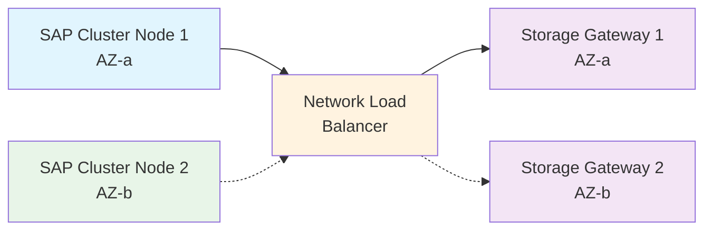
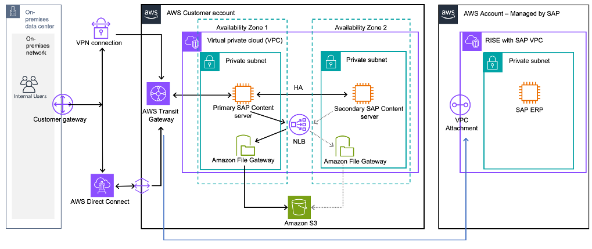

# S3FgwFailOver - SAP Storage Gateway Failover Resource Agent

## Overview

The S3FgwFailOver resource agent enables high availability for AWS Storage Gateway file shares in SAP environments by managing Network Load Balancer (NLB) target registration based on the active cluster node's availability zone. This allows SAP systems to maintain access to S3-backed file shares during failover events.

## Features

- Automatic AZ-aware failover of Storage Gateway instances
- Integration with AWS Network Load Balancer for transparent client access
- Automatic file share cache refresh after failover
- Seamless integration with Pacemaker clusters

## Resource agent build process

This repository contains a modular OCF resource agent for managing S3 File Gateway failover in SAP environments. The agent is built from individual function modules and assembled into a single executable script via GitLab CI/CD.

## Repository Structure

```
├── src/                    # Source modules
│   ├── 01-header.sh       # OCF initialization
│   ├── 02-metadata.sh     # OCF metadata XML
│   ├── 03-validation.sh   # Parameter validation
│   ├── 04-aws-metadata.sh # AWS EC2 metadata operations
│   ├── 05-storage-gateway.sh # Storage Gateway operations
│   ├── 06-nlb-management.sh  # NLB target management
│   ├── 07-resource-actions.sh # Start/stop/monitor functions
│   └── 08-main.sh         # Main execution logic
├── build/                 # Build scripts
│   ├── assemble.sh       # Assembly script
│   └── validate.sh       # Validation script
├── build.yaml            # Build configuration
├── .gitlab-ci.yml        # CI/CD pipeline
└── S3FgwFailOver         # Generated resource agent (auto-created)
```

## Development Workflow

1. **Edit Source Files**: Modify individual function files in `src/`
2. **Local Testing**: Run `./build/assemble.sh` to generate the script locally
3. **Commit Changes**: Push changes to trigger CI/CD pipeline
4. **Auto-Assembly**: Pipeline validates, builds, and commits back the final script

## Local Development

```bash
# Validate source files
./build/validate.sh

# Assemble the resource agent
./build/assemble.sh

# Test the generated script
export OCF_RESKEY_target_group_name="your-target-group"
export OCF_RESKEY_ssm_param_name="your-ssm-parameter"
./S3FgwFailOver validate-all
```

## CI/CD Pipeline

The GitLab CI pipeline:
1. **Validate**: Syntax checking and linting
2. **Build**: Assembles source files into final script
3. **Commit**: Pushes generated script back to repository

## Configuration

Edit `build.yaml` to modify assembly order or validation settings.

## Generated Script

The final `S3FgwFailOver` script is a complete OCF resource agent ready for deployment to Pacemaker clusters.

## Prerequisites for deployment

### Required Software
- AWS CLI (v2 recommended) installed and configured with appropriate permissions
- jq utility installed for JSON parsing
- curl utility for EC2 metadata access
- bash/sh shell environment

### Required AWS IAM permissions:
  - `ec2:DescribeInstances`
  - `elasticloadbalancing:DescribeTargetGroups`
  - `elasticloadbalancing:DescribeTargetHealth`
  - `elasticloadbalancing:RegisterTargets`
  - `elasticloadbalancing:DeregisterTargets`
  - `storagegateway:ListGateways`
  - `storagegateway:ListFileShares`
  - `storagegateway:RefreshCache`
  - `ssm:GetParameter`

## Installation

1. Copy the `S3FgwFailOver` script to the OCF resource agents directory:

```bash
cp S3FgwFailOver /usr/lib/ocf/resource.d/heartbeat/
chmod 755 /usr/lib/ocf/resource.d/heartbeat/S3FgwFailOver
```

2. Create an SSM parameter with the AZ to Storage Gateway instance mapping:

```bash
aws ssm put-parameter \
  --name "S3FgwInstances" \
  --type "String" \
  --value '[{"eu-west-1a":"i-0123456789abcdef0"},{"eu-west-1b":"i-0123456789abcdef1"}]'
```

## Configuration Parameters

| Parameter | Description | Required |
| --------- | ----------- | -------- |
| target_group_name | Name of the NLB target group | Yes |
| ssm_param_name    | Name of the SSM parameter containing AZ to instance mapping | Yes |

## Usage
Add the resource to your Pacemaker cluster configuration for SAP Content Server:

```bash
pcs resource create S3GatewayHA ocf:heartbeat:S3FgwFailOver \
  target_group_name="S3FgwTG" \
  ssm_param_name="S3FgwInstances" \
  op monitor interval=10s timeout=120s \
  op start interval=0 timeout=300s \
  op stop interval=0 timeout=300s
```

## How It Works

1. When the resource starts, it determines the current node's availability zone
2. It looks up the appropriate Storage Gateway instance for that AZ from the SSM parameter
3. It deregisters any existing targets from the NLB target group
4. It registers the appropriate instance as a target
5. It waits for the target to become healthy
6. It refreshes the file share caches to ensure optimal performance my refreshing S3 metadata into Gateway cache

## Architecture

The S3FgwFailOver resource agent orchestrates failover between Storage Gateway instances across availability zones:



**Flow:**
1. Active SAP cluster node determines its availability zone
2. Resource agent registers the corresponding Storage Gateway instance with the NLB
3. NLB routes traffic to the healthy Storage Gateway in the same AZ
4. During failover, the new active node registers its AZ's Storage Gateway
5. File share caches are refreshed to ensure optimal performance



## Cluster Integration

This resource agent is typically used in a resource group with an NFS mount resource:

```bash
pcs resource group add S3GatewayHAGroup S3GatewayHA rsc_fs_CS1_content
```

Where rsc_fs_CS1_content is an NFS mount pointing to the NLB DNS name:

```bash
pcs resource create rsc_fs_CS1_content ocf:heartbeat:Filesystem \
  device="S3FgwLb-1234567801ab.elb.xx-xxxxx-x.amazonaws.com:/fgw-bucket-XXXXXX" \
  directory="/usr/sap/CS1/repos" \
  fstype="nfs4" \
  options="nfsvers=4.1,rsize=1048576,wsize=1048576,hard,timeo=600,retrans=2,noresvport"
```

## Complete Cluster Configuration Guide

### Prerequisites for Full Setup

- Two EC2 instances for the SAP Content Server cluster nodes
- Two separate AWS Storage Gateway instances in different AZs (aligned with above)
- Network Load Balancer with a target group
- SSM parameter with AZ to Storage Gateway instance mapping
- Required IAM permissions for all AWS operations

### Step 1: Basic SAP Content Server Installation and Cluster Prerequisites

Run on both nodes:

```bash
# RHEL
sudo yum install -y pcs pacemaker corosync fence-agents-aws jq aws-cli
```

### Step 2: Configure Cluster Authentication

Run on both SAP Content Server nodes:

```bash
# Set hacluster password
sudo passwd hacluster

# Enable and start pcsd service
sudo systemctl enable pcsd
sudo systemctl start pcsd
```

### Step 3: Create the Cluster

Run on the first node only:
```bash
# Authenticate nodes
sudo pcs host auth <SAP Content Server node1> <SAP Content Server node2> -u hacluster -p <password>

# Create the cluster
sudo pcs cluster setup <ha-cluster-name> <SAP Content Server node1> <SAP Content Server node2>

# Start the cluster services
sudo pcs cluster start --all
sudo pcs cluster enable --all

# Disable STONITH temporarily for setup
sudo pcs property set stonith-enabled=false
```

### Step 4: Install the S3FgwFailOver Custom Resource Agent

Run on both nodes:
```bash
# Copy the resource agent script
sudo cp S3FgwFailOver.sh /usr/lib/ocf/resource.d/heartbeat/S3FgwFailOver
sudo chmod 755 /usr/lib/ocf/resource.d/heartbeat/S3FgwFailOver
```

### Step 5: Configure AWS STONITH Fencing

Run on the first node:
```bash
# Create STONITH device
sudo pcs stonith create <stonith-resource-name> fence_aws \
  pcmk_host_map="<sapcs-primary-hostname>:i-01234567890ab;<sapcs-secondary-hostname>:i-ba09987654321" \
  region="<AWS-REGION>" \
  pcmk_reboot_action="reboot" \
  pcmk_reboot_retries=2 \
  pcmk_reboot_timeout=300 \
  power_timeout=240 \
  pcmk_delay_max=30 \
  op monitor interval=180 timeout=60 \
  op start interval=0s timeout=180 \
  op stop interval=0s timeout=180

# Enable STONITH
sudo pcs property set stonith-enabled=true
```

### Step 6: Configure Cluster Resources and Constraints

Run on the first node:

```bash
# Set cluster defaults
sudo pcs resource defaults resource-stickiness=1 migration-threshold=3

# Create custom S3 Gateway HA resource 
sudo pcs resource create S3GatewayHA ocf:heartbeat:S3FgwFailOver \
  ssm_param_name="<S3FgwInstances>" \
  target_group_name="<S3FgwTG>" \
  op monitor interval=10s timeout=120s \
  op start interval=0s timeout=300s \
  op stop interval=0s timeout=300s

# Create S3 based file system mount
sudo pcs resource create rsc_fs_CS1_content ocf:heartbeat:Filesystem \
  device="S3FgwLb-xxxxxxxxxxxxx.elb.xx-xxxxxx-1.amazonaws.com:/fgw-bucket-xxxxxxx" \
  directory="/usr/sap/CS1/repos" \
  fstype="nfs4" \
  options="nfsvers=4.1,rsize=1048576,wsize=1048576,hard,timeo=600,retrans=2,noresvport" \
  force_unmount="safe" \
  op monitor interval=20s timeout=40s \
  op start interval=0s timeout=60s \
  op stop interval=0s timeout=60s

# Group the S3 Gateway resources
sudo pcs resource group add S3GatewayHAGroup S3GatewayHA rsc_fs_CS1_content

# Create SAP Content Server File System resources
sudo pcs resource create rsc_fs_CS1_C00 ocf:heartbeat:Filesystem \
  device="fs-xxxxxxxxxxx.efs.xx-xxxxx-1.amazonaws.com:/C00" \
  directory="/usr/sap/CS1/C00" \
  fstype="nfs4" \
  options="nfsvers=4.1,rsize=1048576,wsize=1048576,hard,timeo=600,retrans=2,noresvport" \
  force_unmount="safe" \
  op monitor interval=20s timeout=40s \
  op start interval=0s timeout=60s \
  op stop interval=0s timeout=60s

# Create SAP Content Server Virtual IP resource
sudo pcs resource create rsc_ip_CS1_C00 ocf:heartbeat:aws-vpc-move-ip \
  interface="eth0" \
  ip="192.168.xx.xx" \
  routing_table="rtb-xxxxxxxxxxxxx" \
  op monitor interval=20s timeout=40s \
  op start interval=0s timeout=180s \
  op stop interval=0s timeout=180s

# Create the SAP Content Server instance resource with basic parameters
sudo pcs resource create rsc_sap_CS1_C00 ocf:heartbeat:SAPInstance \
  InstanceName="CS1_C00_sapcs1ha" \
  START_PROFILE="/usr/sap/CS1/SYS/profile/CS1_C00_sapcs1ha" \
  AUTOMATIC_RECOVER="false" \
  MONITOR_SERVICES="sapcs" \
  meta resource-stickiness=5000 \
  op monitor interval=11s timeout=60s on-fail=restart \
  op start interval=0s timeout=300s \
  op stop interval=0s timeout=120s \
  op promote interval=0s timeout=320s \
  op demote interval=0s timeout=320s \
  op reload interval=0s timeout=320s \
  op methods interval=0s timeout=5s

# Group the SAP resources
sudo pcs resource group add grp_CS1_C00 rsc_fs_CS1_C00 rsc_ip_CS1_C00 rsc_sap_CS1_C00
sudo pcs resource group meta grp_CS1_C00 resource-stickiness=3000

# Set location preference
sudo pcs constraint location grp_CS1_C00 prefers sapcs1pri=100

# Set ordering constraint
sudo pcs constraint order start S3GatewayHAGroup then start grp_CS1_C00

# Set colocation constraint
sudo pcs constraint colocation add S3GatewayHAGroup with grp_CS1_C00 INFINITY
```

## Troubleshooting

Check cluster logs:
```bash
journalctl -u pacemaker -u corosync
```

Check resource agent logs:
```bash
grep S3FgwFailOver /var/log/pacemaker
grep S3FgwFailOver /var/log/messages
```

Verify the NLB target group status:
```bash
aws elbv2 describe-target-health --target-group-arn <target-group-arn>
```

Check the SSM parameter:
```bash
aws ssm get-parameter --name <ssm-param-name> --query Parameter.Value --output text
```

## Security

See [CONTRIBUTING](CONTRIBUTING.md#security-issue-notifications) for more information.

## License

This library is licensed under the MIT-0 License. See the LICENSE file.

## Authors
